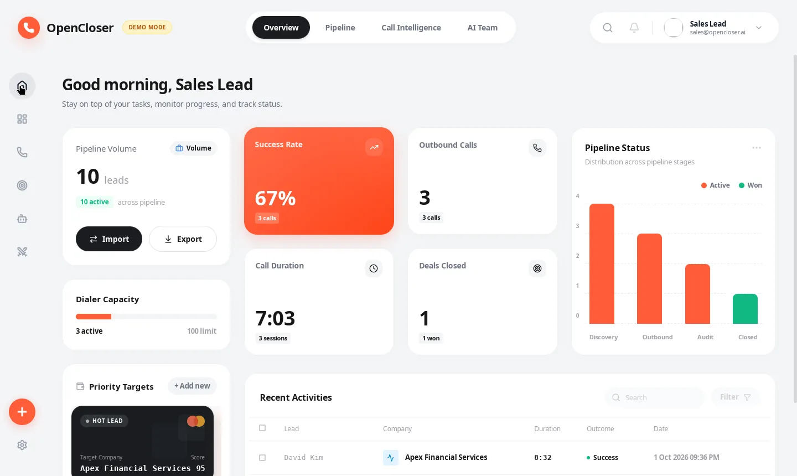
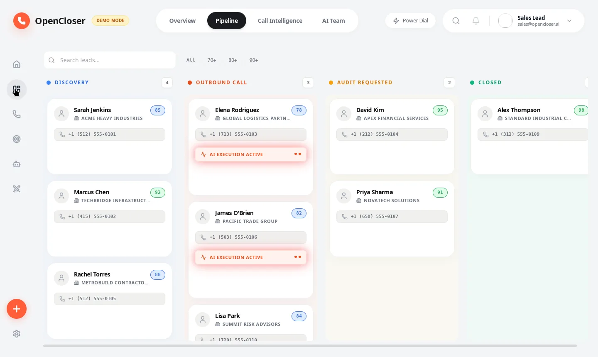
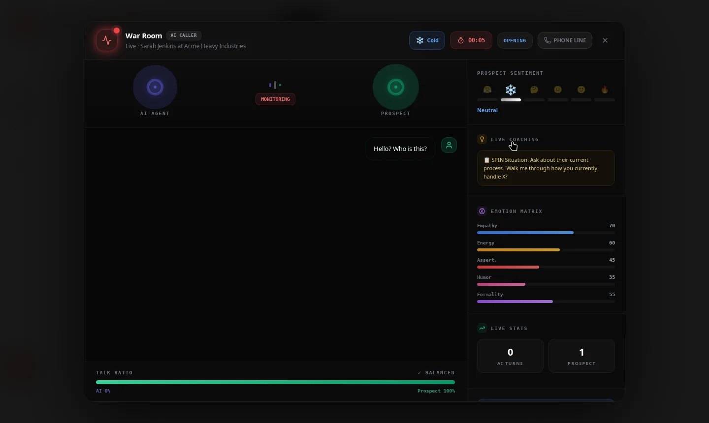
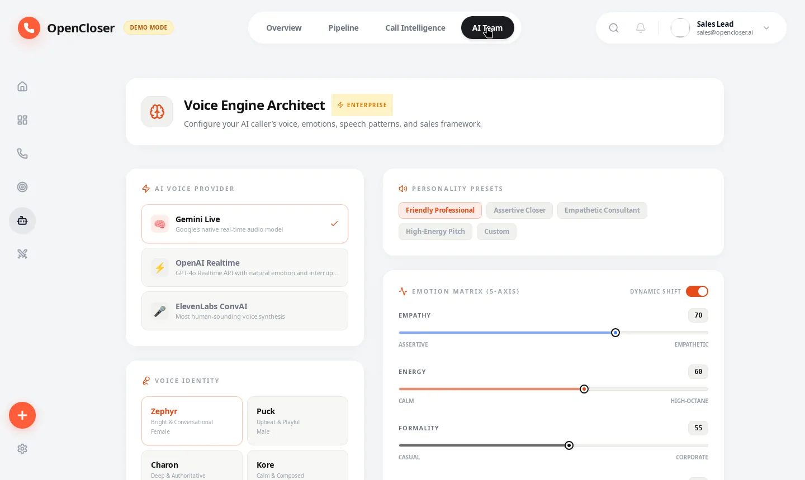
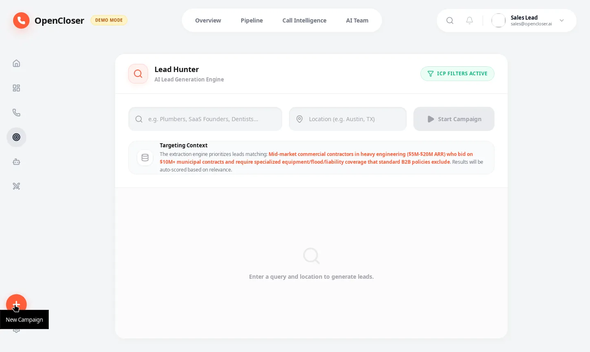
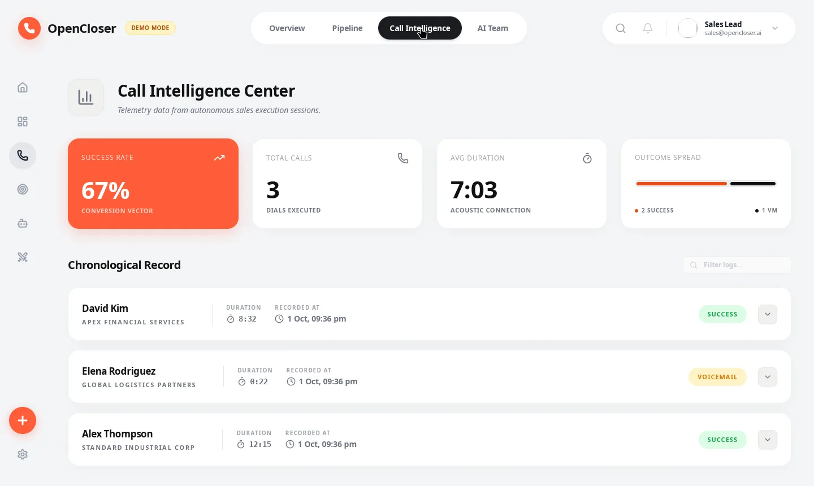
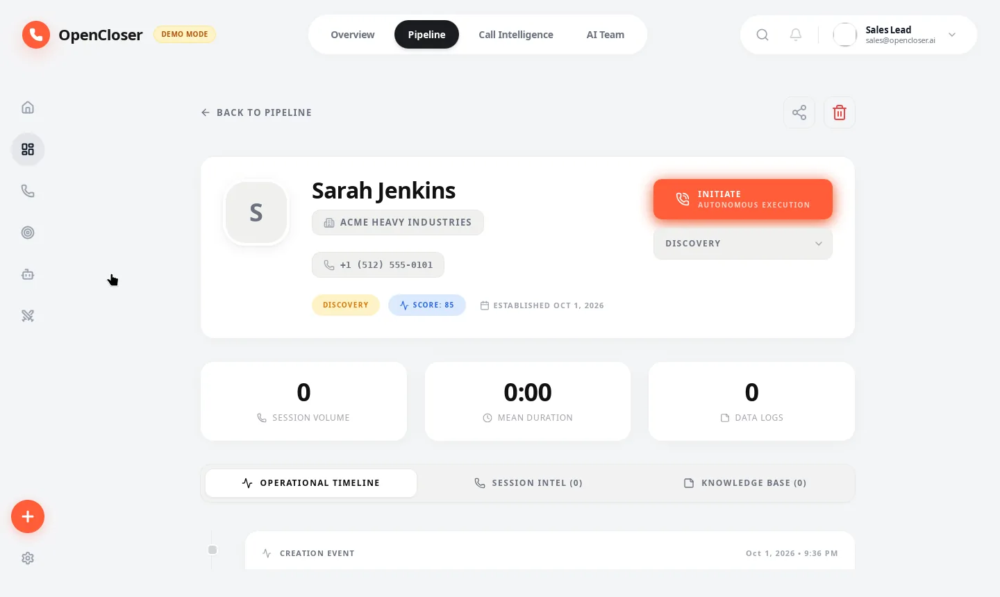
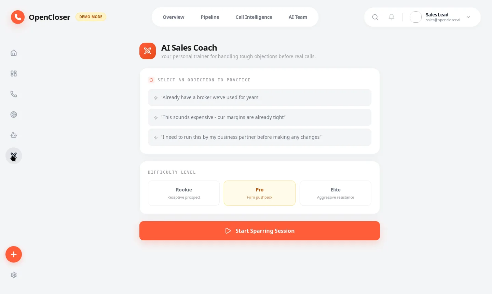
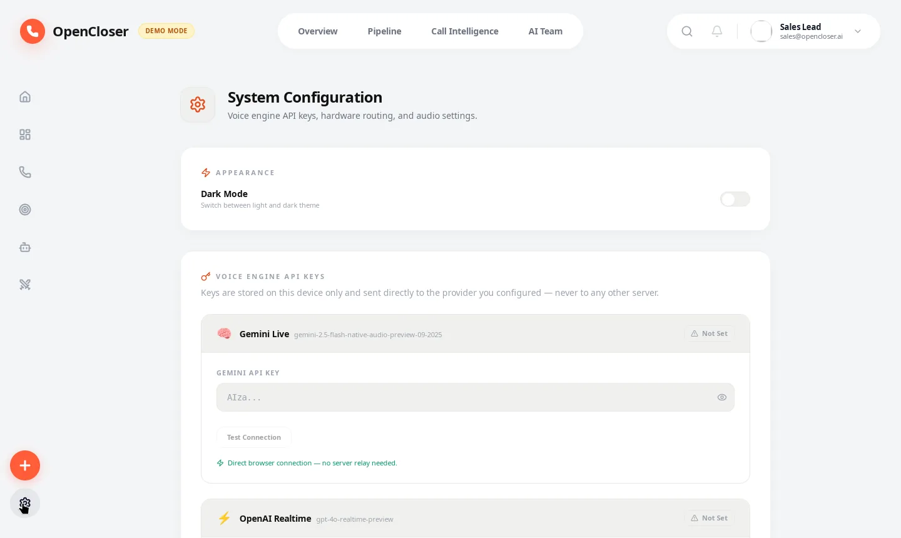

# OpenCloser — Open Source AI SDR & AI Sales Platform

<div align="center">

[](https://github.com/issacops/opencloser)
[](https://tauri.app)
[](https://react.dev)
[](https://www.rust-lang.org)
[](https://www.typescriptlang.org)
[](LICENSE)

[](https://github.com/issacops/opencloser/actions)
[](https://github.com/issacops/opencloser/releases)
[](https://github.com/issacops/opencloser/stargazers)
[](https://github.com/issacops/opencloser/releases)

> **The open source AI sales development platform.** AI cold calling software, lead generation, sales automation, and a full AI SDR team — all running locally on your desktop. No SaaS fees. No cloud dependency. No data ever leaves your machine.

[🎬 Watch the Launch Video](https://issacops.github.io/opencloser/opencloser-launch.mp4) · [🚀 Quick Start](#-quick-start) · [📸 Screenshots](#-screenshots) · [✨ Features](#-your-ai-sales-team) · [🏗️ Architecture](#%EF%B8%8F-architecture) · [📦 Download](https://github.com/issacops/opencloser/releases) · [🤝 Contributing](#-contributing)

</div>

---

## 📸 Screenshots

<div align="center">

| Dashboard | Pipeline Kanban | War Room (Live AI Call) |
|:---:|:---:|:---:|
|  |  |  |
| **KPI dashboard with pipeline analytics** | **Kanban CRM with AI execution tracking** | **Live AI cold call with sentiment & coaching** |

| AI Persona Builder | Lead Hunter | Call Intelligence |
|:---:|:---:|:---:|
|  |  |  |
| **Voice engine architect with emotion matrix** | **AI lead generation with ICP targeting** | **Call analytics with outcome tracking** |

| Lead Detail | Sales Coach | Settings |
|:---:|:---:|:---:|
|  |  |  |
| **360° lead view with timeline & notes** | **Objection sparring with 3 difficulty levels** | **Voice engine, phone line & API key config** |

</div>

---

## ⚡ What is OpenCloser?

OpenCloser is an **open-source AI sales development platform** that runs entirely on your desktop. It gives you an **autonomous AI sales team**: a strategist to build your ICP, a researcher to hunt leads, a voice caller to dial prospects, a coach to train your rebuttals, and a manager to analyze every call — all running locally.

**Why open source AI SDR?** Traditional SDR platforms charge $280–$1,000+/month per seat. OpenCloser is **free, open source, and self-hosted** — your data stays on your machine, your AI keys stay in your browser, and you own the entire stack.

| | Traditional SDR Platform | **OpenCloser** |
|---|---|---|
| **Strategy** | Hire a consultant ($5K+/mo) | AI Strategist generates ICP using SPIN & Challenger in minutes |
| **Research** | SDR manually Googles leads (hours) | AI Researcher hunts, scores & qualifies leads automatically |
| **Cold Calling** | SDR dials 50 calls/day, burns out | AI Caller dials with perfect pitch, never tired |
| **Coaching** | Manager reviews recordings (hours) | AI Coach gives instant post-call analysis |
| **Training** | Roleplay sessions (awkward, infrequent) | AI Sparring Partner available 24/7, adjustable difficulty |
| **Analytics** | Spreadsheets and gut feelings | Real-time dashboards, sentiment analysis, pipeline tracking |
| **Cost** | $280–$1,000+/mo per seat | **Free. Open source. MIT license.** |
| **Data Privacy** | Cloud-hosted, vendor-controlled | **Local-first. Zero cloud dependency.** |

---

## 🎯 Who It's For

- **Solo founders** who need to sell but can't afford a sales team
- **Early-stage startups** that want enterprise-level sales ops from day one
- **Sales teams** looking to augment human reps with AI intelligence
- **Developers** who want to build on top of an open sales AI framework
- **Privacy-conscious teams** who can't send customer data to SaaS platforms

---

## ✨ Your AI Sales Team

### 🧠 AI Sales Strategist
Generates your Ideal Customer Profile (ICP) using SPIN & Challenger frameworks. Asks the right questions during onboarding to deeply understand your market. Builds targeted outreach strategies automatically.

### 🔍 AI Lead Researcher
Autonomous lead hunting with scoring and qualification. Full local-first CRM with Kanban pipeline management. Industry-aware demo mode with 5 keyword categories when no API key is configured.

### 📞 AI Caller (SDR)
Real-time AI voice agent powered by Google Gemini (also supports OpenAI Realtime and ElevenLabs ConvAI). **Built-in Twilio phone lines** — the AI speaks directly into live calls from the War Room (mock mode until you add credentials; bundled cloudflared tunnel for the audio stream). Virtual audio bridge for VoIP apps. Live transcription, sentiment analysis, and objection detection. Power dialing mode for high-volume outreach.

### 🎯 AI Sales Coach
Objection sparring trainer with 3 difficulty levels (Rookie, Pro, Elite). Practice handling 12 objection archetypes against an AI prospect. Real-time encouragement and post-session scoring with specific improvement tips.

### 📊 AI Sales Manager
Post-call AI debrief with sentiment analysis and key insights. Auto-generated follow-up emails. Call analytics dashboard with conversion metrics. Pipeline intelligence with live Kanban board.

---

## 🚀 Quick Start

### Prerequisites

- [Node.js](https://nodejs.org/) (v20+)
- [Rust](https://www.rust-lang.org/tools/install) (latest stable)
- [Tauri prerequisites](https://tauri.app/start/prerequisites/) (system dependencies per platform)

### Run the Desktop App

```bash
git clone https://github.com/issacops/opencloser.git
cd opencloser
npm install
npm run tauri dev
```

### No API Key? No Problem.

OpenCloser works fully in **demo mode** with no API key — 10 realistic seed leads, simulated AI calls, and all features functioning with fallback data. Perfect for evaluation.

### Enable Real AI

Add any of these in Settings → Voice Engine:

| Provider | Key |
|----------|-----|
| Google Gemini | `GEMINI_API_KEY` for onboarding, lead hunting, call analysis |
| OpenAI Realtime | `openai_api_key` for voice calling through the built-in relay |
| ElevenLabs ConvAI | `elevenlabs_api_key` + Agent ID for the most human-like voice |
| Local Ollama | none — fully offline AI (Settings → Offline AI); takes priority over cloud when configured |

Then connect a **Twilio phone line** in Settings → Phone — or skip credentials entirely and phone-line calls run in mock mode.

---

## 🏗️ Architecture

```
opencloser/
├── src/                         # React 19 frontend (TypeScript strict mode)
│   ├── features/
│   │   ├── crm/                # Kanban pipeline, Dashboard, Settings, Persona
│   │   ├── voice/              # War Room, Post-Call Debrief, Objection Trainer
│   │   ├── hunter/             # Lead hunting engine
│   │   └── onboarding/         # AI onboarding + ICP generation
│   ├── stores/                 # 5 Zustand stores (call, navigation, persona, ...)
│   ├── services/               # Typed Tauri invoke wrappers (leads, AI, Twilio)
│   ├── test/                   # 74 Vitest tests across 8 suites
│   └── components/             # AppShell, shared UI
├── src-tauri/                  # Rust backend
│   └── src/
│       ├── ai/gemini.rs        # Gemini API + industry-aware demo mocks
│       ├── ai/ollama.rs        # Offline Ollama path (priority over cloud)
│       ├── twilio/             # Twilio REST + Media Streams + cloudflared tunnel
│       ├── db/                 # SQLite schema + 10 seed leads + migrations
│       ├── relay/              # WebSocket proxy for OpenAI/ElevenLabs
│       └── lib.rs              # 24 Tauri commands registered
└── public/
    └── audio-processor.worklet.js  # Zero-latency PCM capture
```

### Tech Stack

| Layer | Technology |
|-------|-----------|
| **Frontend** | React 19, TypeScript strict, Tailwind CSS 3, Vite 6, Zustand 5 |
| **Desktop Runtime** | Tauri 2.10 |
| **Backend** | Rust (rusqlite, reqwest, tokio, tokio-tungstenite) |
| **Database** | SQLite — local-first, zero cloud dependency |
| **AI** | Google Gemini 2.5 Flash, OpenAI Realtime, ElevenLabs ConvAI, local Ollama |
| **Voice** | Web Audio API + AudioWorklet (zero-latency PCM capture), Twilio Media Streams |
| **Telephony** | Twilio (mock mode included), bundled cloudflared quick tunnel |
| **Tests** | Vitest + React Testing Library (74 tests, 8 suites) + 25 Rust tests |
| **CI/CD** | GitHub Actions — lint, format, knip, test, build, multi-platform release |

---

## 📦 Platform Support

| Platform | Architecture | Download |
|----------|-------------|----------|
| **macOS** | Apple Silicon (ARM64) | `.dmg` |
| **macOS** | Intel (x64) | `.dmg` |
| **Windows** | x86_64 | `.msi` / `.exe` |
| **Linux** | x86_64 | `.deb` / `.AppImage` / `.rpm` |

All packages available on the [Releases page](https://github.com/issacops/opencloser/releases).

---

## 📊 Project Status

| Metric | |
|--------|-------|
| **TypeScript** | Strict mode, 0 errors |
| **Tests** | 74 JS + 25 Rust passing |
| **Codebase** | ~14,400 lines (TS: 10,749 + Rust: 2,869 + CSS: 816) |
| **Bundle** | 404KB main + 9 lazy-loaded chunks |
| **Demo mode** | No API key required — full fallback data, mock phone lines |

---

## 🔒 Privacy & Security

- **All data stays local** — SQLite database on your machine, never synced to any server
- **API keys stored in your browser's localStorage** — never transmitted except to the AI provider you choose; they are sent as headers, never in URLs
- **Offline capable** — configure Ollama (Settings → Offline AI) and interviews, research, call analysis and objection training run entirely local
- **Open source** — every line auditable. MIT license.

---

## 📞 Phone Lines & Audio Bridge

**Option A — Built-in Twilio phone line (recommended):** add your Twilio credentials in Settings → Phone (or stay in mock mode), toggle auto-tunnel, then press **PHONE LINE** in the War Room header. The AI speaks directly into the live call — no virtual cables required.

**Option B — Virtual audio cable (VoIP apps like Phone Link / FaceTime):**

- **Windows:** [VB-Cable](https://vb-audio.com/Cable/) (free)
- **macOS:** [BlackHole](https://existential.audio/blackhole/) (free)
- **Linux:** Use PulseAudio's `null-sink` module

The built-in Audio Setup Wizard guides you through configuration, or skip entirely for VoIP-only mode.

---

## 🤝 Contributing

We welcome contributions! See [AGENTS.md](AGENTS.md) for the full developer guide.

```bash
# Setup
npm install

# Quality gates (run before committing)
npm run lint        # ESLint + strict tsc
npm run format:check
npm run knip        # no unused exports
npm test            # Vitest suites

# Rust gates (in src-tauri/)
cargo fmt --check
cargo clippy --all-targets -- -D warnings
cargo test

# Run desktop app
npm run tauri dev
```

1. Fork the repository
2. Create a feature branch (`git checkout -b feat/amazing-feature`)
3. Commit your changes with clear messages
4. Ensure `npm run lint` and `npm test` pass
5. Open a Pull Request

---

## 📄 License

MIT License — see [LICENSE](LICENSE) for details.

---

## 🙏 Acknowledgments

- [Tauri](https://tauri.app/) — Making native desktop apps accessible to web developers
- [Google Gemini](https://deepmind.google/technologies/gemini/) — The AI backbone
- [OpenAI](https://openai.com/) — Realtime voice API
- [ElevenLabs](https://elevenlabs.io/) — Most human-sounding voice synthesis
- [Lucide Icons](https://lucide.dev/) — Beautiful icon set

---

<div align="center">

**Built with ❤️ for sales teams who want an unfair advantage.**

[⭐ Star This Repo](https://github.com/issacops/opencloser/stargazers) · [🐛 Report Bug](https://github.com/issacops/opencloser/issues) · [💡 Request Feature](https://github.com/issacops/opencloser/issues) · [📖 Developer Guide](AGENTS.md) · [📦 Releases](https://github.com/issacops/opencloser/releases)

---

**Keywords:** `open source AI SDR` `AI sales platform` `AI cold calling software` `self-hosted AI sales agent` `sales automation` `AI voice caller` `desktop CRM` `lead generation` `open source CRM` `Tauri` `React` `Rust` `TypeScript` `Gemini AI` `sentiment analysis` `sales pipeline` `objection handling` `Twilio` `Ollama` `local AI`

</div>
